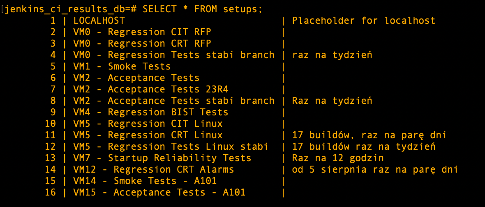
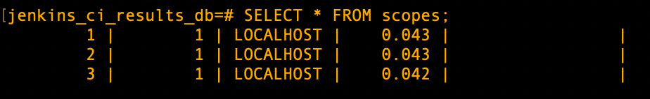
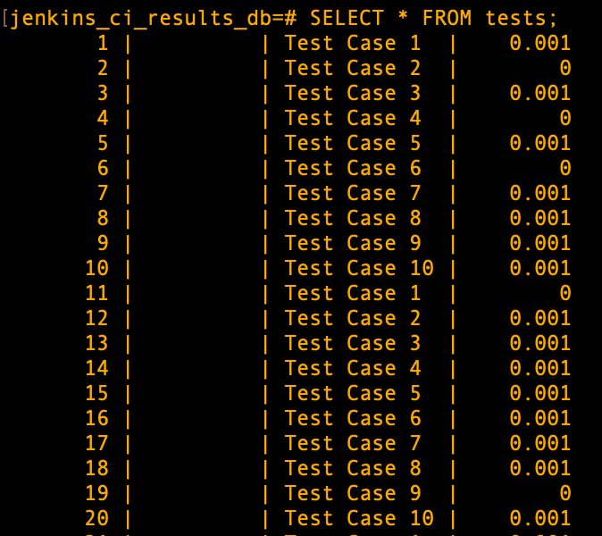

# JENKINS CI RESULTS WEBSITE

This project is a prototype of a web server that will contain live-results for automated tests on CI setups.
The tests are being automatically run in Robot Framework.

## My starting requirements for the web server

Information we need is:

- setup IP or job name (like AT, ST etc.) - will be taken from jenkins parameters
- build being tested - robot framework listener
- test suite being tested - robot framework listener
- progress (which TC is being tested out of how many) - robot framework listener
- results - could be taken from either one

## Summary of the project, requirements from others

Live view of the setups, visualised altogether on one page
Content:

- setup name
- which scope is being run
- jenkins info (last few runs, queue, status, stats and duration of tests)
- list of failing test cases
- karczoch link to logs
- pass or fail depending on number of failing tests (>= 80% pass is a passing run)

## Jenkins API

Jenkins information is taken from the jobs listed here:
[Jenkins CI_5G_robot_AVQL search](http://janusz.emea.nsn-net.net:8080/search/?q=CI_5G_robot_AVQL_&Jenkins-Crumb=2f226643baba61453f6c7e39cc93d6e2e4bd376e90ab2944b3f04fdc6daa0942)

I've created a list of pipelines managed by our team and with CI methodology based on that search.
Currently the json file contains fields such as:

- setup
- job_name
- ip (of the setup)
- URL (full url on jenkins)
- comment

## Currently

The flask app connects to the database and truncates all the tables in the database (resetting the primary keys).
Afterwards, it populates the table 'setups' with records based on the setups_config.json file:

The listener has methods end_test() and end_suite() that are writing into the database as follows:

- end_suite() that writes to 'scopes'

- end_test() that writes to 'tests'

## TODO

- integration with a database - **IN PROGRESS**
- robot framework listener - **IN PROGRESS**
- restructuring so simple-server.py is not overloaded
- visualisation on the website
- links to karczoch logs
