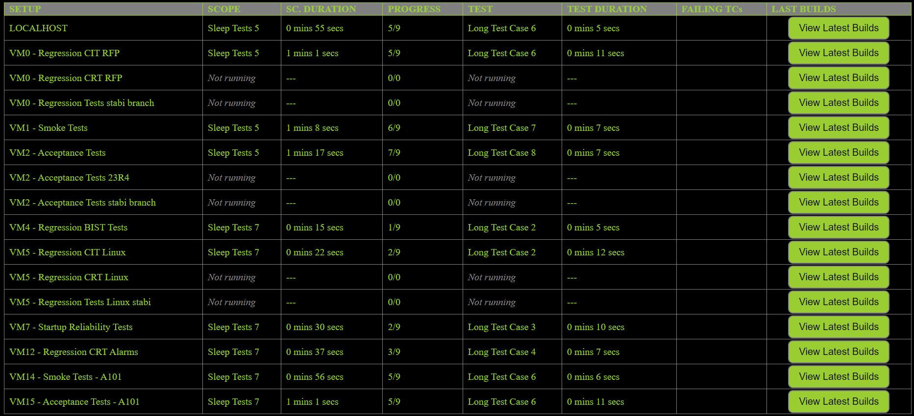
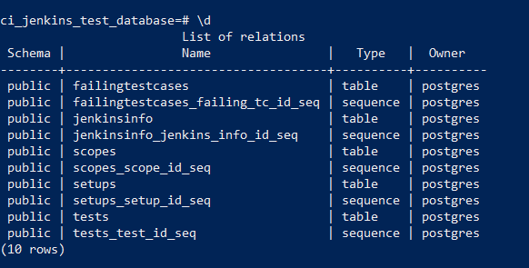

# JENKINS CI RESULTS WEBSITE

This project is a prototype of a web server that will contain live-results for automated tests on CI setups.
The tests are being automatically run in Robot Framework.

## CURRENT VIEW



## TODO

- correct display of suite setup and suite teardown duration:
	- for setup - if the suite is not nested, we can calculate duration from the start_time of the suite, if it's nested we have to calculate duration from the end_time of the last run suite
	- for teardown - we have to calculate duration from the end_time of the last test case of the current suite
- figure out how to get setup_id by ip with dupliating ips
- links to karczoch logs
- Suites, instead of Scopes
- failing test cases from the current build column
- take IPs from jenkins api (console output of a job) instead of hard coding it in json


### Summary of the project, requirements from others

Live view of the setups, visualised altogether on one page
Content:
- setup name
- which scope is being run
- jenkins info (last few runs, queue, status, stats and duration of tests)
- list of failing test cases
- karczoch link to logs
- pass or fail depending on number of failing tests (>= 80% pass is a passing run)

### Jenkins API

Jenkins information is taken from the jobs listed here:
[Jenkins CI_5G_robot_AVQL search](http://janusz.emea.nsn-net.net:8080/search/?q=CI_5G_robot_AVQL_&Jenkins-Crumb=2f226643baba61453f6c7e39cc93d6e2e4bd376e90ab2944b3f04fdc6daa0942)

I've created a list of pipelines managed by our team and with CI methodology based on that search.
Currently the json file contains fields such as:
  
- setup
- job_name
- ip (of the setup)
- URL (full url on jenkins)
- comment

### Database

Using postgresql@15 run the following commands, first one in any normal terminal, then in the psql cli.

```
psql -U postgres
CREATE DATABASE ci_monitor_db;
\c ci_monitor_db;
```

The next thing that needs to be done is to create a .env file in the main directory and fill it with database's credentials.

Then copy the schema.sql file and paste into the command line in psql. This will create tables and relations between the tables. Only afterwards one can run the web server and tests.
After successfully creating the tables, one should see the following output when running \d command:



### TODO / BUGS

- execution forcefully stopped (double CTRL + C) doesn't fail the test cases properly - only after new suite started is started it works properly.
- log the duration of suite startup somehow
