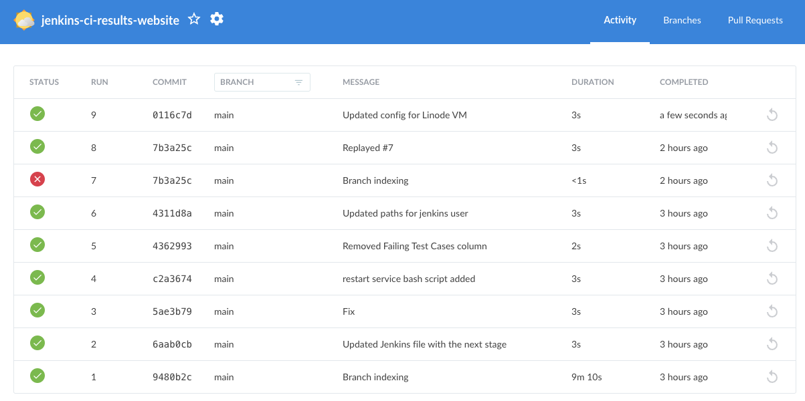

# JENKINS CI RESULTS WEBSITE

This project is a public version a web server that contains live-results for automated tests on CI setups.
The tests are being automatically run in Robot Framework. I use a Robot Framework listener written in Python to send POST and PUT requests to the server's endpoints to update the status of tests and suites.
Basic functionality:

- tracking current test name and its duration
- tracking current suite name and its duration
- tracking progress of the suite - how many tests have already been completed
- View Latest Builds button that creates a popup with information about last builds from jenkins (URLs have to be set correctly in setups_config.json file)

## CURRENT VIEW

This is an example view with multiple VM setups running different tests concurrently.

## LINODE VM SETUP WITH JENKINS

I used to host this server on a debian11 VM self-hosted by my prior company. However to illustrate and create a PoC setup I have decided to use Linode's hosting options (2 Debian11 VMs). One is a Jenkins server that has a very simple pipeline with two stages:

- Pulling from Github - I wanted to use web-hooks to have the server watch the repo, but opted to poll every minute instead
- Restarting the ci_monitor_tool.service after the repo has been updated

Restarting is being done with a simple bash script. This enables the web server to be automatically updated and the website mirrors the state of the repo, so manual pulling and restarting the service is not necessary.

## SERVER SETUP

On the same server as the Jenkins server, there is also the python Flask application (this repo) and nginx and gunicorn. Nginx acts as a reverse proxy and gunicorn serves the application. When a request hits Nginx, it forwards the request to Gunicorn, which then passes it to the Flask app.
There is also a postgresql13 database set up - with the schema that can be seen in schema.sql file in the app/database folder.

All three of these things demand some configuration to make everything work properly and be accessible from the internet. The next thing to take into account is firewall rules and the listen_addresses.

## LISTENER SETUP

The last part of this project is a Linode VM (also debian11) that is the "test" instance, which means it's the VM that performs tests and updates the state of the server's database or internal memory (progress and setup and teardown duration is stored in server's memory).
It also had to be configured a little bit -> earlier version was utilizing private IP addresses but with Linodes, I had to check the public IP with 'ip route'.

## IMPROVEMENTS TO BE ADDED

- Comprehensive tests, binary checks etc. that would be run before restarting the service
- Cron table config on test nodes - schedule tests to run every x hours
- Make test Linode's be Jenkins agents which pull the repo's current version the same as the server
